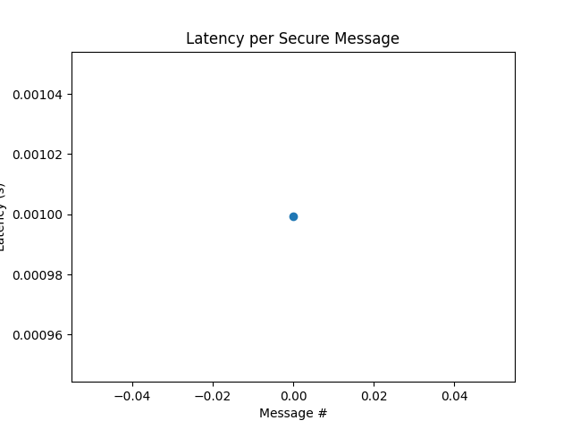
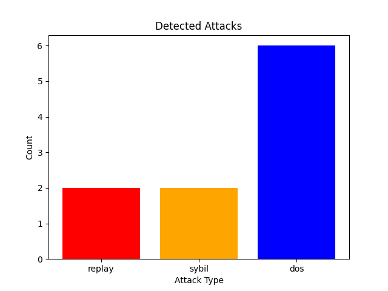

---

```markdown
# 🚗 Secure Communication Protocols for Vehicle-to-Vehicle (V2V) Networks

This project simulates **secure V2V communication** using cryptographic techniques (AES, RSA, Digital Signatures) and detects common network attacks (**Replay, Sybil, DoS**).  
It demonstrates how vehicles can exchange safety-critical messages securely, even in the presence of malicious actors.

---

## 📂 Project Structure
```

V2V-Secure-Protocol-Project/
│
├── docs/
│ ├── literature_review\.md # Summary of existing V2V security protocols
│ ├── design.md # Proposed AES + RSA + Signature design
│ └── results.md # Simulation results and analysis
│
├── src/
│ ├── main.py # Entry point: runs vehicles, attacks, IDS, and plots
│ ├── config.py # Settings: number of vehicles, ports, thresholds
│ │
│ ├── vehicles/
│ │ └── vehicle.py # Vehicle class (keys, send/receive secure msgs)
│ │
│ ├── security/
│ │ ├── aes_encryption.py # AES encryption/decryption
│ │ ├── rsa_auth.py # RSA key generation and exchange
│ │ ├── digital_signature.py # Signing & verification
│ │ └── intrusion_detection.py # Replay, Sybil, and DoS detection
│ │
│ ├── network/
│ │ ├── socket_comm.py # TCP/UDP socket communication
│ │ └── message_format.py # JSON message schema
│ │
│ ├── attacks/
│ │ ├── replay_attack.py # Replays old messages
│ │ ├── sybil_attack.py # Fake IDs
│ │ └── dos_attack.py # Floods with junk packets
│ │
│ └── utils/
│ ├── logger.py # Logs events (INFO, ATTACK, WARNING)
│ └── plotter.py # Plots latency and attack frequency
│
├── tests/
│ └── test_security.py # Unit tests for AES, RSA, Signatures
│
├── simulation_results/
│ ├── logs.txt # Saved runtime logs
│ ├── latency.png # Graph of message latency
│ └── attacks.png # Graph of attack detections
│
├── requirements.txt # Dependencies
└── README.md # (This file)

````

---

## ⚙️ Installation

1. Clone the repo:
   ```bash
   git clone https://github.com/your-username/V2V-Secure-Protocol-Project.git
   cd V2V-Secure-Protocol-Project
````

2. Install dependencies:

   ```bash
   pip install -r requirements.txt
   ```

---

## ▶️ How to Run

### Run Tests

Check that AES, RSA, and Signatures work correctly:

```bash
python -m unittest tests/test_security.py
```

Expected output:

```
...
Ran 3 tests in 0.9s
OK
```

### Run Simulation

Start the full V2V simulation with attacks:

```bash
python -m src.main
```

Sample output:

```
[INFO] 2025-08-18 19:34:39 - AES session key securely exchanged between V1 and V2
[SERVER] Listening on port 5000
[INFO] Vehicle1 sent secure message.
[INFO] Vehicle2 received: {...}
[ATTACK] Replay attack detected from V1
[ATTACK] Sybil attack detected! Fake ID: FakeCar123
[WARNING] Possible DoS attack from V1 (too many msgs/sec)
[RESULTS] Graphs saved in simulation_results/ (latency.png, attacks.png)
```

---

## 📊 Results

The simulation produces two key results (saved in `simulation_results/`):

1. **Latency Graph (latency.png)**

   - Shows message delivery delays before/after attacks.

2. **Attack Detection Graph (attacks.png)**

   - Shows frequency of Replay, Sybil, and DoS detections.

Example screenshots:




---

## 🛡️ Security Features

- 🔒 **AES Encryption** → Secure message confidentiality
- 🔑 **RSA Key Exchange** → Secure AES session sharing
- ✍️ **Digital Signatures** → Authenticity of sender
- 🕵️ **Intrusion Detection** → Detects Replay, Sybil, and DoS attacks

---

## 📌 Conclusion

This project successfully demonstrates a **lightweight but secure V2V protocol**.
It ensures that even under replay, sybil, and DoS attacks, the receiving vehicle can still identify threats and maintain secure communication.

---

## 👨‍💻 Author

- Jyotiprakash Panda (B.Tech Project, 2025)

```
